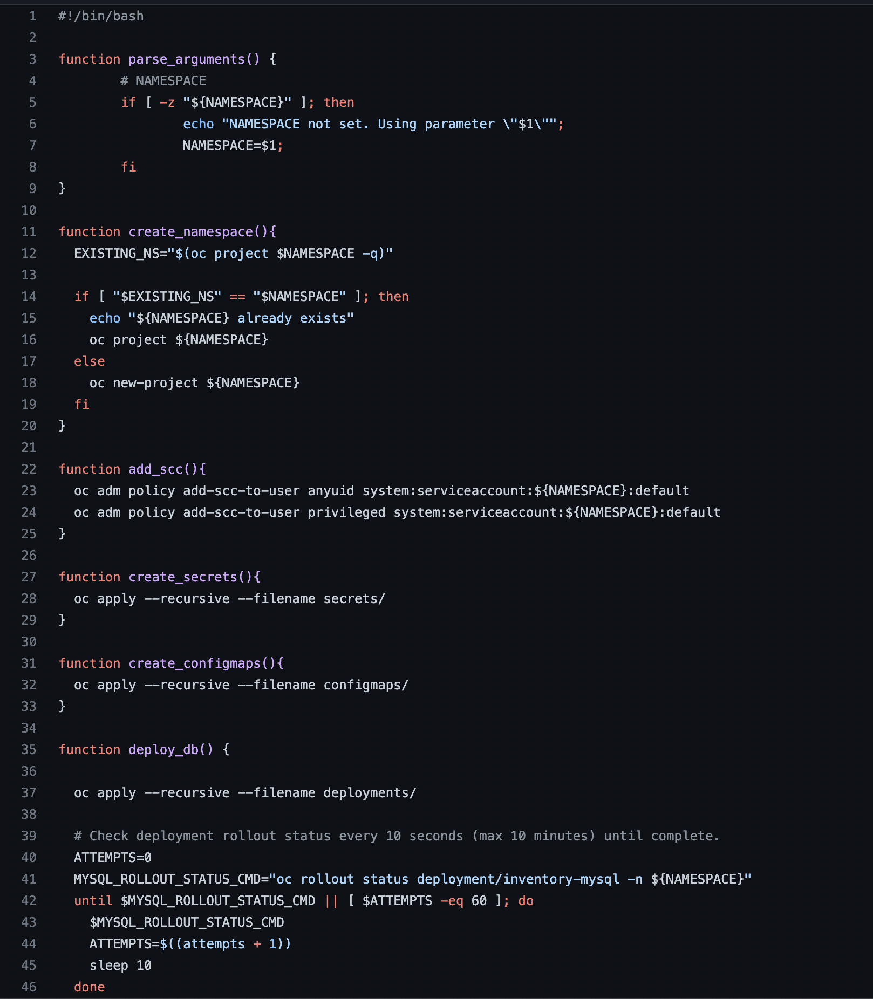
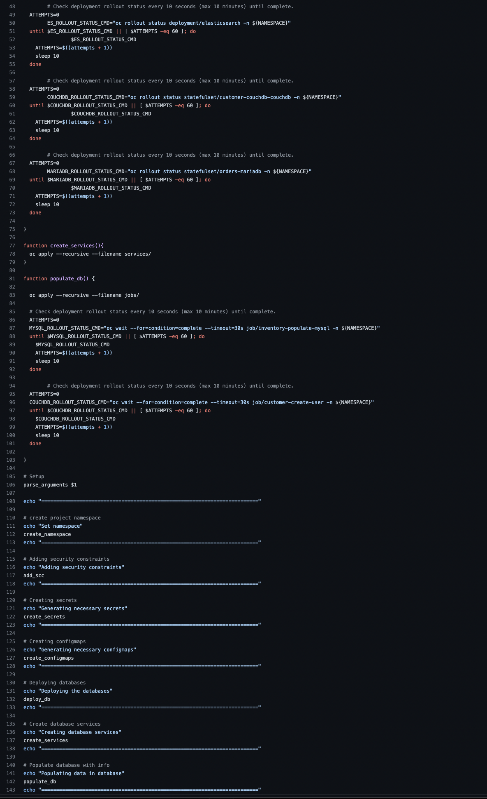
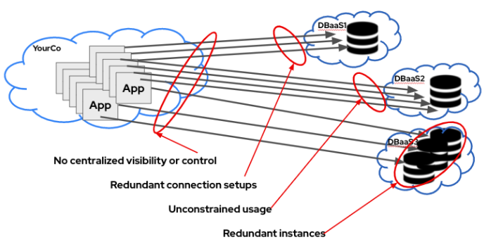
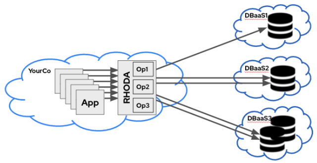

***Introduction***

Database is one of the key building blocks for a variety of applications. Currently most openshift customers run their databases on the same cluster, manage it themselves and provide access to developers. Database as a service makes this much simpler, allowing databases to run at a central location managed by database administrators allowing business to focus on their applications.

The Red Hat Database as a service add-on enables:

- Easy consumption of Database as a service from ISVs like MongoDB Atlas, Crunchy Bridge, and CockroachCloud on kubernetes clusters
- Easy management, monitoring and control by administrators of DBaaS consumption, usage, status across cluster and clouds
- Enables end to end managed support experience
- For Alpha release DBaaS Add-on enables ease of consumption for developers and simple management for administrators on one managed OpenShift Platform (OSD and ROSA) . There is a prerequisite that a customer has bought (or enrolled in a trial version for) the DBaaS instances from ISV vendor MongoDB Atlas or Crunchy Bridge.

DBaaS project is developed and productized using iterative development processes to allow feedback from users, enable/help ISV develop the required functionality and quickly release those to users. Following sections are focussed on the service definition as planned for Alpha release of DbaaS.

***Current Scenario***

Imagine if we need to deploy one or more services that needs to interact with a database, one of the simplest ways of getting Database available for us while deploying in OpenShift would like something like below 

***Shell Script***

***Challenges for ad hoc DBaaS in the Enterprise***

***Solution: Red Hat OpenShift Database Access (RHODA)***

- Faster and easier self-service for developers
- More efficient connection, DB utilization
- Centralized monitoring, consistent control plane for admins

